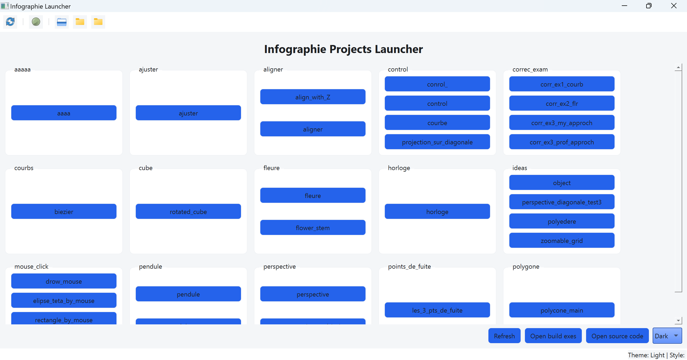
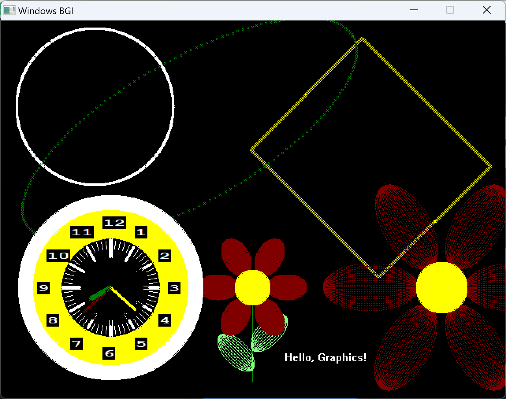

# Projet d'Infographie – Master Machine Learning Avancé et Intelligence Multimédia (MLAIM, FSDM, USMBA) | WinBGIm + Qt UI Launcher

Ce dépôt s’inscrit dans le cadre de ma formation au Master Machine Learning Avancé et Intelligence Multimédia (MLAIM) à la Faculté des Sciences Dhar El Mahraz (FSDM), Université Sidi Mohamed Ben Abdellah (USMBA), Fès – Maroc, dans le cours d’Infographie. Il regroupe l’ensemble des exercices, travaux pratiques (TP), contrôles et sujets d’examen, accompagnés d’un lanceur graphique (Qt) et d’une boîte à outils WinBGIm permettant la compilation et l’exécution rapides des démonstrations.

Objectifs pédagogiques
- Mettre en œuvre les fondements algorithmiques du dessin (lignes, cercles, ellipses – algorithmes de Bresenham et variantes),
- Manipuler la géométrie 2D/3D (transformations, projections parallèle/perspective, repères, matrices),
- Développer des interactions temps réel (dessin à la souris, visualisation dynamique),
- Structurer un pipeline reproductible de compilation/exécution (UI Qt et CMake, MinGW/WinBGIm),
- Consolider les apprentissages par des exercices guidés, TP, contrôles et examens.

Avertissement pédagogique
- Le code est volontairement didactique (priorité à la lisibilité et à la progressivité). Certaines implémentations ne visent pas l’optimisation « production », mais l’illustration des concepts vus en cours.
- Le projet cible Windows/MinGW avec WinBGIm; l’UI Qt sert de lanceur et de « laboratoire » pour explorer rapidement les exercices.

---

## English summary

Below is the original technical README (unchanged in substance), detailing repository structure, setup, features, and usage in English. The French preface above provides academic context and learning objectives.

# Infographie Projects (WinBGIm + Qt UI Launcher)

A collection of interactive computer graphics exercises and demos built with the WinBGIm graphics library (Borland Graphics Interface for Windows/MinGW) and a Qt-based UI launcher that can compile and run individual samples on demand.

The repository includes:
- A Qt UI launcher to browse, compile, and run the samples from a single interface.
- A WinBGIm-based graphics toolkit and many C++ samples for drawing algorithms, mouse interaction, and simple 3D rendering.
- A CMake build that can build the console samples and optionally the Qt UI.


## Contents

- `code_graphics/`
  - `Graphics/` — WinBGIm headers and static library (`graphics.h`, `winbgim.h`, `libbgi.a`).
  - `includs/` — Shared utility header(s), for example `graphics_utils.h` with drawing, matrix, and interaction helpers.
  - `src_graphics/` — All sample sources grouped by topic (mouse, ellipse, perspective, cube, etc.).
  - `CMakeLists.txt` — Builds selected console samples with MinGW, linking BGI.
- `UI_luncher_infographie_projects/` — Qt 5/6 Widgets app for discovering, compiling, and running samples.
- `CMakeLists.txt` (root) — Adds `code_graphics/` and optionally the UI subdirectory.
- `build_exes/` — Output folder where the UI launcher writes compiled sample executables.


## Features

### UI Launcher (Qt)
- Scans `code_graphics/src_graphics/*` and lists each folder as a panel with buttons per `*.cpp` file.
- Compiles a chosen sample with MinGW (g++) and runs the produced `.exe`.
- Adds required include and library paths automatically (`Graphics` and `includs`), and links `libbgi.a + gdi32 + comdlg32 + uuid + oleaut32 + ole32`.
- Forces the console subsystem, so the linker looks for `main()` (no `WinMain` required).
- Defines `PI` at compile time to support samples that use it directly.
- Detects non-standard entry points (e.g. `int main_corr_ex1()`) and auto-generates a tiny wrapper `main()` to run them without changing original sources.
- Handles file-in-use errors and can offer to terminate a running executable before overwriting it.

### Graphics Toolkit
- Basic drawing utilities: pixels, Bresenham line/circle/ellipse, rotated rectangles/ellipses, coordinate axes, etc.
- Matrix utilities for 2D/3D transformations, simple projections (parallel/perspective), and helpers for labeling and geometry.
- Many interactive mouse-driven demos (draw lines/rectangles/ellipses by dragging and clicking).


## Screenshots

Below are two representative screenshots captured from the project. Click to view full-size.

- UI Launcher (Qt):
  <a href="docs/assets/infographie_UI_Launcher.png"></a>

- Hello Graphics sample window:
  <a href="docs/assets/hello_graphics.png"></a>


## Demo video

Option A — Embed an MP4 stored in this repo (recommended for short clips):

<!-- The player below will work once you add docs/assets/demo.mp4 -->
<video src="docs/assets/demo.mp4" controls width="900" poster="docs/assets/hello_graphics.png">
  Your browser does not support embedded videos. Here is a direct link: 
  <a href="docs/assets/demo.mp4">docs/assets/demo.mp4</a>
</video>

<p><a href="docs/assets/demo.mp4">Direct link to demo.mp4</a></p>

Option B — Link to YouTube (good for longer videos):

<a href="https://youtu.be/REPLACE_WITH_VIDEO_ID" target="_blank">
  
</a>


## Prerequisites (Windows)

- MinGW or TDM-GCC (32 or 64-bit) with g++ on PATH. The UI defaults to `C:/TDM-GCC-32/bin/g++.exe`—you can change this in `UI_luncher_infographie_projects/mainwindow.cpp` (variable `gppPath`).
- Qt 5/6 (for the UI launcher). Example: Qt 6.9 MinGW.
- WinBGIm library and headers already included under `code_graphics/Graphics/`.


## Quick Start

### Run the UI Launcher (Qt)

- Open `UI_luncher_infographie_projects` in Qt Creator (MinGW kit) and build.
- Alternatively, configure with CMake (MinGW Makefiles) and build the `UI_luncher_infographie_projects` target.
- Launch `UI_luncher_infographie_projects.exe`.
- Click “Refresh” to scan samples.
- Click any sample button to compile (into `build_exes/`) and run.
- If your compiler is not at `C:/TDM-GCC-32/bin/g++.exe`, edit `mainwindow.cpp` and change `gppPath` to your g++.

### Build Console Samples (CMake)

- Uses MinGW and links BGI. The root CMake exposes an option `BUILD_UI` (ON/OFF). The console samples do not require Qt.

```bat
:: Configure (console samples only)
"C:\\Qt\\Tools\\CMake_64\\bin\\cmake.exe" -S "C:\\Users\\LENOVO i7\\Desktop\\ligacy_progects\\infographie" -B "C:\\Users\\LENOVO i7\\Desktop\\ligacy_progects\\infographie\\_cmake_build" -G "MinGW Makefiles" -DBUILD_UI=OFF

:: Build
"C:\\Qt\\Tools\\mingw1120_64\\bin\\mingw32-make.exe" -C "C:\\Users\\LENOVO i7\\Desktop\\ligacy_progects\\infographie\\_cmake_build"
```

> Note: Paths above are examples; adjust for your Qt/MinGW installation. For 32-bit MinGW, use the proper `mingw32-make.exe` path.


## Running Samples Manually (optional)

If you prefer compiling a single sample yourself, this is the minimal link line (adjust paths and file names):

```bat
C:\\TDM-GCC-32\\bin\\g++.exe ^
  -std=c++17 -O2 -mconsole -Wl,-subsystem,console -DPI=3.14159265358979323846 ^
  -I"code_graphics/Graphics" -I"code_graphics/includs" ^
  code_graphics/src_graphics/correc_exam/corr_ex2_flr.cpp ^
  -L"code_graphics/Graphics" -lbgi -lgdi32 -lcomdlg32 -luuid -loleaut32 -lole32 -lm ^
  -o build_exes/corr_ex2_flr.exe
```


## Known Issues & Fixes

- “undefined reference to `WinMain@16`”
  - Cause: Linking as a GUI subsystem without a `WinMain`. Fixes:
    - Console samples: force console subsystem (`-mconsole`, `-Wl,-subsystem,console`).
    - Qt UI: link `Qt::WinMain` only when available, otherwise build as console (done in CMake).
- “`PI` was not declared in this scope”
  - Some samples use `PI` directly. Fixes:
    - Define in source `#ifndef PI #define PI 3.14159265358979323846 #endif`, or
    - Compile with `-DPI=3.14159265358979323846` (the UI does this automatically).
- Graphics headers not found
  - Ensure includes point to `code_graphics/Graphics` and `code_graphics/includs`.
- File locked when recompiling from UI
  - The UI offers to terminate the running `.exe` via `taskkill` before overwriting.


## Sample Catalog (non-exhaustive)

- `correc_exam/`
  - `corr_ex2_flr.cpp` — Flower drawn via rotated ellipses; optimized for speed.
- `mouse_click/`
  - `rectangle_teta_by_mouse.cpp` — Draw & rotate rectangle interactively with the mouse.
  - `drow_mouse.cpp`, `elipse_teta_by_mouse.cpp` — Mouse-driven drawing utilities.
- `courbs/` — Bézier curve demos.
- `cube/` — Rotated cube drawing.
- `perspective/`, `points_de_fuite/` — Perspective projection demos.
- `ideas/`
  - `object.cpp` — 3D object (cube) with transforms and projections, animated.
- `aligner/`, `control/`, `pendule/`, `polygone/`, etc. — Additional exercises and utilities.


## Demo: 3D Object Controls (ideas/object.cpp)

- ESC — quit
- Space — pause/resume
- P — toggle Perspective / Parallel
- + / - — increase/decrease perspective distance `d`
- L — toggle labels
- S / F — slow down / speed up rotation
- R — reset object and settings


## Development Notes

- The UI launcher compiles samples with:
  - `-std=c++17 -O2 -mconsole -Wl,-subsystem,console -DPI=…`
  - Include paths: `code_graphics/Graphics`, `code_graphics/includs`, and project root.
  - Link: `libbgi.a`, `gdi32`, `comdlg32`, `uuid`, `oleaut32`, `ole32`, and `m` (math).
- The console CMake targets link the same BGI stack and enforce the console subsystem on Windows.


## Contributing

- Keep sample programs small and focused; prefer one concept per file/folder.
- Reuse helpers from `includs/graphics_utils.h` instead of duplicating logic.
- If a sample lacks a standard `int main()`, provide a wrapper or upgrade it for easier UI launching.


## License

- No license file was provided. If you plan to publish or share, consider adding a suitable license file.


## Acknowledgments

- WinBGIm for enabling classic BGI-style graphics on modern Windows/MinGW.
- Qt for the cross-platform UI toolkit.

## Add your own sample (how to use)

The UI launcher will automatically show a button for every `*.cpp` file under `code_graphics/src_graphics/**`.
To add your own graphic program and run it from the launcher:

1) Open the sources folder from the toolbar
- In the launcher, click: Toolbar > “Open src_graphics”.
- This opens `code_graphics/src_graphics` in Explorer.

2) Create a new subfolder and a C++ file
- Create a new folder, for example: `code_graphics/src_graphics/my_demo/`.
- Inside it, create a file, for example: `my_first_demo.cpp`.

3) Write your graphic code with a standard `main()`
- Your file must define `int main()` so the launcher can compile and run it.
- Minimal starter template you can paste:

```cpp
#include "../../Graphics/graphics.h"           // WinBGIm
#include "../../includs/graphics_utils.h"      // Optional helpers from this repo

int main() {
    // Open a window (width, height, title)
    initwindow(800, 600, "My First Demo");

    // Draw something
    circle(0, 0, 100);                // circle centered at screen center (utils remap coordinates)
    line_bresenham(-150, 0, 150, 0, WHITE, 1);

    getch();                          // wait for a key
    closegraph();                     // close window
    return 0;
}
```

Notes:
- Includes: Because your file sits under `code_graphics/src_graphics/<your_folder>`, `../../Graphics/graphics.h` and `../../includs/graphics_utils.h` resolve correctement. Alternatively, you can use `#include "code_graphics/Graphics/graphics.h"` if you prefer project-root style includes (the UI adds project root to include paths).
- PI macro: The UI defines `-DPI=3.14159265358979323846` at compile time; you may use `PI` directly.
- Subsystem: The UI forces the console subsystem, so `main()` is required (no `WinMain`).

4) Refresh and run
- Return to the launcher and click “Refresh”.
- Your new file will appear as a button under the folder name (e.g. “my_first_demo”).
- Click the button to compile into `build_exes/` and run.

Troubleshooting
- Button doesn’t apparaître: Ensure the file extension is `.cpp`, it’s placed under `code_graphics/src_graphics/<your_folder>/`, and you clicked “Refresh”.
- “No entry point”: Ensure your file contains a standard `int main()`. The launcher can auto-wrap some `main_*` patterns, but `main()` is recommended.
- “graphics.h not found”: Use the relative includes shown above, or ensure your includes match the folder depth. The UI already adds `Graphics/`, `includs/`, and project root to the include paths.
- Link errors (WinMain@16): The launcher compiles as a console app; confirm you didn’t add `-mwindows` in your code or flags.
